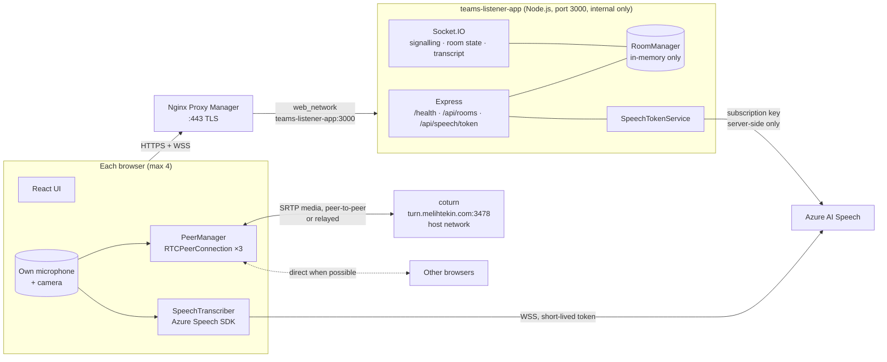
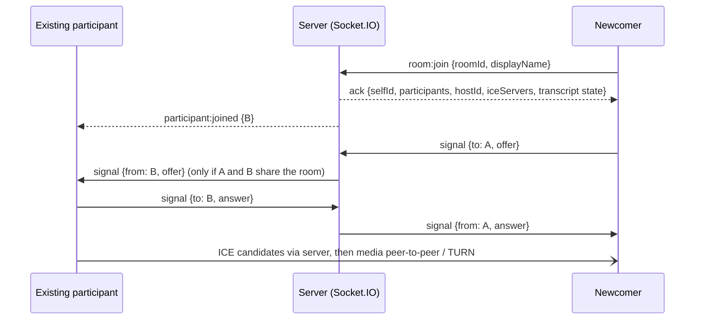
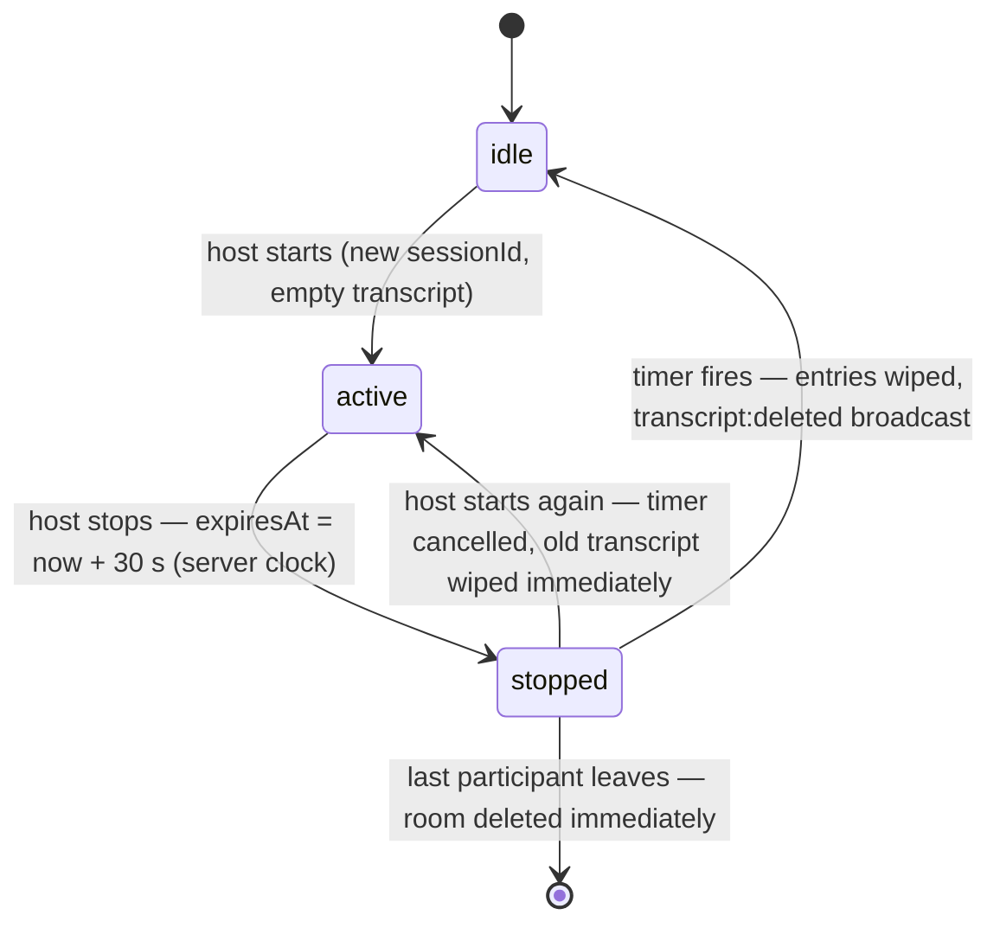

# Teams Listener Demo

A deliberately small browser video meeting for **up to 4 people** whose purpose is to demonstrate **live Azure AI Speech transcription** with correct speaker names.

Production URL: **https://teamslistener.melihtekin.com**

> This is **not** a Teams clone. It has video, audio, mute, camera toggle, live transcript, and a 30‑second transcript download window — nothing else. No chat, screen sharing, recording, accounts, database or Microsoft Graph.

---

## Contents

1. [What it does](#1-what-it-does)
2. [Architecture](#2-architecture)
3. [Why WebRTC mesh is fine for 4 users](#3-why-webrtc-mesh-is-fine-for-4-users)
4. [How Azure Speech is used](#4-how-azure-speech-is-used)
5. [Why speaker diarization is not needed](#5-why-speaker-diarization-is-not-needed)
6. [Privacy and the 30‑second transcript lifecycle](#6-privacy-and-the-30-second-transcript-lifecycle)
7. [Environment variables](#7-environment-variables)
8. [Local development](#8-local-development)
9. [Azure Speech requirements](#9-azure-speech-requirements)
10. [Docker deployment](#10-docker-deployment)
11. [coturn (TURN server)](#11-coturn-turn-server)
12. [DNS configuration](#12-dns-configuration)
13. [Nginx Proxy Manager configuration](#13-nginx-proxy-manager-configuration)
14. [Production deployment commands](#14-production-deployment-commands)
15. [Troubleshooting WebRTC](#15-troubleshooting-webrtc)
16. [Troubleshooting Azure Speech](#16-troubleshooting-azure-speech)
17. [Security notes](#17-security-notes)
18. [Repository layout](#18-repository-layout)

---

## 1. What it does

- **Landing page:** enter a display name, then **Create Meeting** (you become host) or **Join Meeting** with a meeting ID / invite link.
- **Meeting:** real WebRTC audio + video between up to 4 browsers. A 5th person sees *"This meeting is full. Maximum 4 participants."*
- **Controls:** mute/unmute, camera on/off, start/stop live transcript (host only), leave.
- **Layout:** 1 participant = large centred tile; 2 = two columns; 3–4 = 2×2 grid. Tiles show name, "(You)", host crown, muted-mic badge and a camera-off avatar.
- **Live transcript:** when the host starts it, a panel opens on the **right** for everyone, a *"Live transcript active"* banner is shown, and every browser transcribes **its own microphone** with Azure Speech. Final sentences appear for everyone with the speaker's name and time.
- **Stop:** everyone sees *"Live transcription has stopped."*, *"Would you like to download the transcript?"* with a **Download (.txt)** button, and a server‑synchronised countdown *"This transcript will be permanently deleted in 00:30"*. At 00:00 the server deletes it and it disappears from all screens.

## 2. Architecture



| Concern | Where |
| --- | --- |
| Room/host/transcript rules (pure, unit-tested) | `server/src/rooms/RoomManager.ts` |
| Socket.IO wiring, validation, rate limiting | `server/src/socket/*` |
| Azure token exchange + caching | `server/src/speech/azureToken.ts` |
| ICE/TURN configuration (static or HMAC ephemeral creds) | `server/src/ice.ts` |
| HTTP (health, room creation, token, static client, CSP) | `server/src/http/app.ts` |
| Shared typed protocol | `shared/protocol.ts` |
| WebRTC mesh | `client/src/webrtc/PeerManager.ts` |
| Azure recognition on own mic | `client/src/speech/SpeechTranscriber.ts` |
| Meeting orchestration (socket + peers + speech) | `client/src/meeting/MeetingController.ts` |

**Media never passes through Node.** The server only relays small signalling messages (SDP, ICE candidates) between members of the same room. Audio/video flows browser↔browser, or via coturn when a direct path is impossible.

### Signalling flow



The newcomer always sends the offer (no glare), both sides always negotiate one audio + one video transceiver, and mute/camera toggles only flip `track.enabled` — no renegotiation is ever needed. If a connection fails (or stays *disconnected* for 4 s) the offerer performs an ICE restart. If the Socket.IO connection drops, the client automatically rejoins and rebuilds its peer connections.

## 3. Why WebRTC mesh is fine for 4 users

In a mesh each participant sends its stream to every other participant: with *n* people each browser has *n − 1* uplinks. For n = 4 that is 3 outgoing video streams (~1–2.5 Mbps each at 720p) — well within a normal desktop/broadband connection. The benefits:

- no media server (SFU/MCU) to deploy, scale or secure;
- end-to-end DTLS‑SRTP between browsers; the server never sees media;
- the Node process stays tiny.

Mesh does not scale beyond ~4–5 participants, which is exactly why the room limit is enforced server-side.

## 4. How Azure Speech is used

1. When the host clicks **Start Live Transcript**, the server creates a new transcript session and broadcasts `transcript:started`.
2. Each browser calls `GET /api/speech/token` with its participant token (issued at join). The server exchanges `AZURE_SPEECH_KEY` for a **10‑minute Azure authorization token** (`https://<region>.api.cognitive.microsoft.com/sts/v1.0/issueToken`) and returns only `{ token, region, language, refreshAfterSeconds }`.
3. The browser lazily loads the Speech SDK, creates `SpeechConfig.fromAuthorizationToken(token, region)` with language `tr-TR` (configurable), and runs **continuous recognition** on a clone of its **own** microphone track.
4. Intermediate (`recognizing`) results are shown locally in italics; only **final** (`recognized`) results are sent to the server as `{ sessionId, text }`.
5. The server attaches identity from the socket's server-side session (participant ID, display name, server timestamp) and broadcasts the entry to the room.

**Token refresh:** the server caches one Azure token for at most 4 minutes, so any token handed out has ≥ 6 minutes left. Clients refresh every `refreshAfterSeconds` (3 minutes) and assign the new token to the running recognizer (`recognizer.authorizationToken = …`), so long sessions do not break when a token expires.

**Failure handling:** if recognition fails for one participant, it retries automatically (3× with back‑off, fetching a new token), then shows *"Live transcription failed for your microphone"* with a **Retry** button — to that participant only. Their audio/video and everybody else's transcription continue. Azure error details are never shown or logged, only the cancellation code in the browser console.

**Mute:** the recognizer listens to a clone of the mic track whose `enabled` flag mirrors the mute button, so a muted participant is not transcribed.

## 5. Why speaker diarization is not needed

Diarization guesses *who* spoke from a mixed audio stream. Here there is no mixed stream: every browser recognizes only its owner's microphone, and the server stamps each final result with the identity bound to that socket when it joined. The speaker label is therefore exact, free, and language-independent. The server ignores any `userId`/`displayName` a client puts in the payload, so one participant cannot post text under another's name.

## 6. Privacy and the 30‑second transcript lifecycle



- Transcript entries exist **only in the Node process memory** (and in each open browser tab's memory while displayed).
- No database, Redis, files, `localStorage`, `sessionStorage` or service worker. Transcript text is never logged.
- On stop, the server sets `transcriptExpiresAt = now + 30 s` and schedules deletion. Clients render the countdown from that server timestamp, corrected for clock skew (`serverNow` is sent with the event), so all participants see the same number.
- After deletion the entry array is emptied, state is reset, download requests return *"No transcript is available"*, and every client removes the panel.
- Starting a new session during the window cancels the old timer and discards the old transcript first; entries tagged with an old `sessionId` are rejected.
- A short 5‑second grace accepts final results the recognizer flushes right after "stop".
- When the last participant leaves, the room — including any transcript and timers — is deleted immediately.
- Downloads are generated on demand from memory (UTF‑8 with BOM, sanitised filename `transcript-<room>-<yyyy-mm-dd-hh-mm>.txt`) and never written to disk.

Example download:

```
Teams Listener Meeting Transcript
29 September 2026

14:05:31 - Melih
Bugünkü toplantıya başlayabiliriz.

14:05:37 - Ahmet
Azure Speech tarafı çalışıyor.
```

## 7. Environment variables

See [`.env.example`](.env.example). Summary:

| Variable | Default | Purpose |
| --- | --- | --- |
| `NODE_ENV` | `development` | `production` enables the Socket.IO origin check and HTTPS-only headers |
| `PORT` | `3000` | Internal HTTP port |
| `PUBLIC_BASE_URL` | – | Public URL; its origin is the only allowed Socket.IO origin in production |
| `TRUST_PROXY` | `1` | Reverse proxy hops (NPM = 1) for correct client IPs in rate limiting |
| `LOG_LEVEL` | `info` | `debug`/`info`/`warn`/`error` |
| `AZURE_SPEECH_KEY` | – | **Secret.** Azure Speech resource key (server only) |
| `AZURE_SPEECH_REGION` | – | e.g. `westeurope` |
| `AZURE_SPEECH_LANGUAGE` | `tr-TR` | Recognition language |
| `STUN_URL` | – | Comma-separated STUN URLs |
| `TURN_URL` | – | Comma-separated TURN URLs (UDP + TCP recommended) |
| `TURN_SHARED_SECRET` | – | **Secret.** Recommended: app mints time-limited TURN credentials (coturn `use-auth-secret`) |
| `TURN_CREDENTIAL_TTL_SECONDS` | `21600` | Lifetime of minted TURN credentials |
| `TURN_USERNAME` / `TURN_PASSWORD` | – | **Secret.** Static credentials, used only if no shared secret |
| `TURN_REALM` | – | coturn realm (`turn.melihtekin.com`) |
| `TURN_PORT` | `3478` | coturn listening port (UDP + TCP) |
| `TURN_MIN_PORT` / `TURN_MAX_PORT` | `49160` / `49200` | coturn UDP relay range |
| `TURN_EXTERNAL_IP` | – | Public IP advertised by coturn (`31.40.204.61`) |
| `TURN_LISTENING_IP` | – | Optional: bind coturn to one IP |

ICE servers (including TURN credentials) are sent only to sockets that have joined a room, never through a public endpoint.

## 8. Local development

Requirements: Node.js ≥ 22, npm ≥ 10.

```bash
npm install
cp .env.example .env        # optional: add Azure key/region to test transcription
npm run dev                 # server on :3000 (tsx watch) + Vite on :5173 (proxying /api and /socket.io)
```

Open http://localhost:5173 in two different browser profiles/windows (camera/mic work on `localhost` without HTTPS). `npm run dev` loads `.env` if present and always runs in development mode (no production origin check). Without Azure settings, meetings work and the transcript panel shows a per-user recognition error.

Quality gates (all must pass):

```bash
npm run lint
npm run typecheck
npm test
npm run build
npm run check      # all of the above
```

To run the **production image** locally (port bound to 127.0.0.1 only; no NPM/coturn required):

```bash
docker compose -f docker-compose.dev.yml up --build
# http://localhost:3000
```

## 9. Azure Speech requirements

1. An Azure subscription with an **Azure AI Speech** (or multi-service AI Services) resource.
2. Copy **Key 1** and the **Region** (e.g. `westeurope`) from *Keys and Endpoint* into `.env`.
3. The resource must be reachable with a regional STS endpoint (`<region>.api.cognitive.microsoft.com`). Resources with only a custom domain and local-auth disabled are not supported by this MVP.
4. Pricing: standard real-time speech-to-text is billed per audio hour; each participant runs its own stream while the transcript is active. The free F0 tier allows limited concurrent requests — use S0 for 4 concurrent speakers.
5. The browser connects to `wss://<region>.stt.speech.microsoft.com`; the CSP allows `*.speech.microsoft.com`, `*.api.cognitive.microsoft.com` and `*.cognitiveservices.azure.com`.

## 10. Docker deployment

- `Dockerfile` — multi-stage build (Node 22 Alpine): builds client and server, installs only server production dependencies, runs as the unprivileged `node` user, includes a `HEALTHCHECK` on `/health`.
- `docker-compose.yml` — production:
  - `app` → container **`teams-listener-app`**, `expose: ["3000"]` (**not published** to the host), attached to the **external `web_network`** used by Nginx Proxy Manager, read-only root FS, all capabilities dropped, `no-new-privileges`.
  - `coturn` → container `teams-listener-coturn`, `network_mode: host`, config generated from env at start (see below).
- `docker-compose.dev.yml` — standalone local variant publishing `127.0.0.1:3000` only.

## 11. coturn (TURN server)

TURN relays media when two browsers cannot reach each other directly (symmetric NAT, corporate firewalls). It runs with **host networking** so it sees the real public IP and can open its relay port range without Docker port mapping, and it does **not** go through Nginx Proxy Manager.

- Listens on **3478/udp and 3478/tcp** (`TURN_PORT`).
- Relay ports **49160–49200/udp** (41 ports; each call leg uses one — plenty for 4 users).
- Authentication: with `TURN_SHARED_SECRET` coturn uses `use-auth-secret` and the app hands each participant HMAC-SHA1 time-limited credentials (TURN REST API scheme). Otherwise a static `TURN_USERNAME`/`TURN_PASSWORD` pair (`lt-cred-mech`).
- `coturn/entrypoint.sh` writes `turnserver.conf` into a tmpfs with mode 600 — credentials never appear in command-line arguments or logs.
- Relaying to private, loopback, link-local and multicast ranges is denied (prevents using TURN to reach internal services).
- No TLS listener (TURNS/5349) is configured; plain TURN over UDP/TCP 3478 covers the demo. Media is still encrypted end-to-end by DTLS-SRTP.

## 12. DNS configuration

In Cloudflare (both records **DNS only / grey cloud**):

| Type | Name | Value | Proxy |
| --- | --- | --- | --- |
| A | `teamslistener` | `31.40.204.61` | DNS only |
| A | `turn` | `31.40.204.61` | **DNS only (required)** |

Cloudflare's proxy cannot carry TURN/UDP, so `turn` must stay grey. (The app record may later be proxied if WebSockets are enabled in Cloudflare, but it is intended as DNS only.)

Required inbound ports on the server/firewall:

| Port | Protocol | Service |
| --- | --- | --- |
| 80, 443 | TCP | Nginx Proxy Manager (already in place) |
| 3478 | UDP + TCP | coturn |
| 49160–49200 | UDP | coturn relay range |

Port 3000 must **not** be opened.

## 13. Nginx Proxy Manager configuration

Add a **Proxy Host**:

| Field | Value |
| --- | --- |
| Domain Names | `teamslistener.melihtekin.com` |
| Scheme | `http` |
| Forward Hostname / IP | `teams-listener-app` |
| Forward Port | `3000` |
| Cache Assets | off |
| Block Common Exploits | on |
| **Websockets Support** | **ON** (required for Socket.IO) |
| SSL → SSL Certificate | Request a new Let's Encrypt certificate |
| SSL → **Force SSL** | **ON** |
| SSL → **HTTP/2 Support** | **ON** |
| SSL → HSTS | optional |

NPM resolves `teams-listener-app` because both containers are on `web_network`. No custom Nginx config is required.

## 14. Production deployment commands

Full step-by-step guide: [`docs/DEPLOYMENT.md`](docs/DEPLOYMENT.md).

```bash
git clone https://github.com/slashet/teams-listener-demo.git
cd teams-listener-demo
cp .env.example .env
chmod 600 .env
nano .env                      # fill AZURE_SPEECH_KEY, AZURE_SPEECH_REGION, TURN_SHARED_SECRET, …
docker compose up -d --build
docker compose ps
docker compose logs --tail=100 app
```

Then configure the NPM proxy host (section 13). Update later with `git pull && docker compose up -d --build`.

## 15. Troubleshooting WebRTC

| Symptom | Checks |
| --- | --- |
| "Camera/microphone permission was denied" | Click the camera icon in the address bar, allow both, reload. The site must be HTTPS (or localhost). |
| Tile stays "Connecting…" | Usually no route between peers: verify TURN. Open `chrome://webrtc-internals` (Firefox: `about:webrtc`) and look for `relay` candidates. |
| No `relay` candidates | Check `TURN_URL`, credentials, `docker compose logs coturn`, DNS `turn.melihtekin.com → 31.40.204.61` (DNS only) and that 3478 udp/tcp + 49160–49200/udp are open in UFW **and** the provider firewall. |
| Works on same network, fails across networks | Classic missing-TURN symptom — see above. Test with https://webrtc.github.io/samples/src/content/peerconnection/trickle-ice/ using a credential from the join payload. |
| "Click to enable audio" button on a tile | Browser autoplay policy; one click resumes playback. |
| Socket keeps "Reconnecting…" | NPM Websockets Support must be ON; `PUBLIC_BASE_URL` must exactly match the browser origin (`https://teamslistener.melihtekin.com`). |
| Hearing yourself | The local tile is always muted; echo is usually another participant's speakers — use headphones. |

## 16. Troubleshooting Azure Speech

| Symptom | Checks |
| --- | --- |
| "Azure Speech is not configured" in logs / 503 from token endpoint | `AZURE_SPEECH_KEY` and `AZURE_SPEECH_REGION` missing in `.env`; recreate the container. |
| 502 "Could not obtain a speech token" | Wrong key/region, or outbound HTTPS to `<region>.api.cognitive.microsoft.com` blocked. The server logs only `SpeechTokenError`, never the response body. |
| "Live transcription failed for your microphone" | Browser console shows the cancellation code (e.g. `AuthenticationFailure`, `ConnectionFailure`). Check that `wss://<region>.stt.speech.microsoft.com` is reachable and that the tier allows 4 concurrent streams. Press **Retry**. |
| Nothing transcribed | Microphone muted, wrong language (`AZURE_SPEECH_LANGUAGE`), or the mic delivers silence. |
| Transcription stops after ~10 min | Should not happen (token refresh). If it does, check that `GET /api/speech/token` still succeeds (rate limit is 30/min/IP). |

## 17. Security notes

- Azure subscription key never leaves the server; browsers get 10‑minute tokens only, and only while a transcript is active and only with a valid participant token.
- Room IDs: 64 random bits (`crypto.randomBytes`), no listing endpoint. The creator gets a one-time host key held only in memory.
- All Socket.IO payloads are validated with Zod (room ID, display name ≤ 40 chars with control/bidi characters stripped, SDP/ICE shape and size, transcript text ≤ 1000 chars).
- Only joined sockets can send room events; signalling can only target participants of the sender's own room; only the host can start/stop transcripts; identity is always server-side.
- Per-socket token-bucket rate limits per event type, per-IP limits on room creation and token requests, max 20 concurrent sockets per IP, 64 KB max message size, max 500 rooms.
- Production rejects Socket.IO connections from foreign origins (cross-site WebSocket hijacking).
- Strict CSP, `frame-ancestors 'none'`, Permissions-Policy limited to camera/microphone.
- Logs contain room IDs, participant IDs, event names and error types — never transcript text, tokens, keys or TURN passwords.

## 18. Repository layout

```
├── client/                 React + Vite frontend
│   └── src/{components,pages,meeting,webrtc,speech,lib}
├── server/                 Express + Socket.IO backend
│   ├── src/{rooms,socket,speech,http}
│   └── test/               Vitest (unit + Socket.IO integration)
├── shared/protocol.ts      Typed Socket.IO protocol shared by both
├── coturn/entrypoint.sh    Generates coturn config from env
├── docs/DEPLOYMENT.md      Production runbook
├── Dockerfile
├── docker-compose.yml      Production (external web_network, no published app port)
├── docker-compose.dev.yml  Local production-image test
└── .env.example
```
