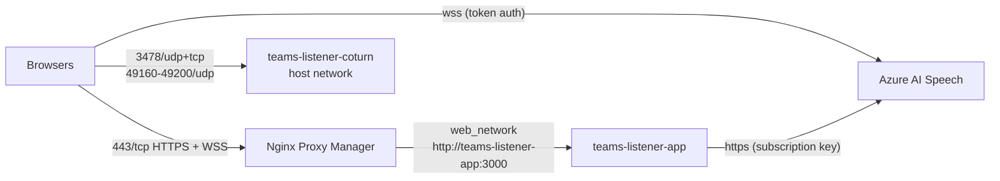

# Production Deployment — teamslistener.melihtekin.com

Runbook for the production server. Nothing in this repository executes commands on the server; follow these steps manually.

## Target environment

| Item | Value |
| --- | --- |
| OS | Ubuntu 26.04.1 LTS (6 vCPU, 7.7 GB RAM) |
| Docker / Compose | Docker 29.2.1, Docker Compose v5.0.2 |
| Public IP | `31.40.204.61` |
| App domain | `teamslistener.melihtekin.com` |
| TURN domain | `turn.melihtekin.com` |
| Reverse proxy | Nginx Proxy Manager (owns host ports 80/443) on Docker network `web_network` |
| App container | `teams-listener-app`, internal port `3000` (not published) |
| TURN container | `teams-listener-coturn`, host networking |



## 1. DNS (Cloudflare)

Create/verify these records. Both must be **DNS only** (grey cloud):

| Type | Name | Content | Proxy status | TTL |
| --- | --- | --- | --- | --- |
| A | `teamslistener` | `31.40.204.61` | DNS only | Auto |
| A | `turn` | `31.40.204.61` | **DNS only** | Auto |

Verify from any machine:

```bash
dig +short teamslistener.melihtekin.com   # → 31.40.204.61
dig +short turn.melihtekin.com            # → 31.40.204.61
```

TURN cannot work through the Cloudflare proxy (it is UDP and not HTTP).

## 2. Firewall

Allow inbound (both in UFW and in any provider/cloud firewall):

| Port(s) | Protocol | Purpose |
| --- | --- | --- |
| 80, 443 | TCP | Nginx Proxy Manager (already open) |
| 3478 | UDP and TCP | TURN/STUN (coturn) |
| 49160–49200 | UDP | TURN relay range (`TURN_MIN_PORT`–`TURN_MAX_PORT`) |

With UFW:

```bash
sudo ufw allow 3478/udp
sudo ufw allow 3478/tcp
sudo ufw allow 49160:49200/udp
sudo ufw status
```

Do **not** open port 3000. The application port is only reachable inside `web_network`.

> Note: Docker-published ports bypass UFW, but this setup publishes none: the app uses `expose` only and coturn uses host networking (which *is* subject to UFW), so the rules above are required for TURN.

## 3. Prerequisites check

```bash
docker --version
docker compose version
docker network inspect web_network --format '{{.Name}} {{.Driver}} internal={{.Internal}}'
# → web_network bridge internal=false
```

The external network must exist before `docker compose up`, otherwise Compose fails with "network web_network declared as external, but could not be found".

## 4. Get the code

```bash
cd /opt            # or any directory you use for stacks
sudo git clone https://github.com/slashet/teams-listener-demo.git
sudo chown -R "$USER": teams-listener-demo
cd teams-listener-demo
```

## 5. Configure secrets

```bash
cp .env.example .env
chmod 600 .env
nano .env
```

Fill in at least:

| Variable | Value |
| --- | --- |
| `AZURE_SPEECH_KEY` | Key 1 of the Azure Speech resource |
| `AZURE_SPEECH_REGION` | Region of that resource, e.g. `westeurope` |
| `AZURE_SPEECH_LANGUAGE` | `tr-TR` (default) |
| `TURN_SHARED_SECRET` | a long random value, e.g. generated with `openssl rand -hex 32` (paste it into `.env`; do not store it anywhere else) |
| `TURN_EXTERNAL_IP` | `31.40.204.61` |
| `TURN_LISTENING_IP` | `31.40.204.61` (see below) |

`TURN_LISTENING_IP` pins coturn's listener **and relay** sockets to one address. Check that the public IP is configured on the host interface:

```bash
ip -4 -brief addr | grep 31.40.204.61
```

If it is not listed (1:1 NAT), set `TURN_LISTENING_IP` to the private interface IP and keep `TURN_EXTERNAL_IP=31.40.204.61`. The coturn log line `Relay address to use: …` shows the result.

Memory limits (`MAX_ROOMS=100`, `MAX_TRANSCRIPT_ENTRIES=2000`, `MAX_TRANSCRIPT_CHARS_PER_SESSION=500000`) can normally stay at their defaults.

Leave `PUBLIC_BASE_URL=https://teamslistener.melihtekin.com`, `NODE_ENV=production`, `TRUST_PROXY=1` and the TURN URL/realm/port defaults as in the example.

Using static TURN credentials instead: leave `TURN_SHARED_SECRET` empty and set `TURN_USERNAME` (no `:`) and `TURN_PASSWORD`. The shared-secret mode is preferred because each participant then receives short-lived credentials instead of a permanent password.

Never commit `.env` (it is in `.gitignore`) and avoid commands that print it (`cat .env`, `docker compose config`, `docker inspect` of the containers' environment).

## 6. Build and start

```bash
docker compose up -d --build
```

This builds `teams-listener-demo:latest`, starts `teams-listener-app` on `web_network` (port 3000 exposed only to that network) and starts `teams-listener-coturn` on the host network.

## 7. Verify

```bash
docker compose ps
# teams-listener-app      ... Up (healthy)
# teams-listener-coturn   ... Up

docker compose logs --tail=50 app
docker compose logs --tail=50 coturn
docker logs teams-listener-app --tail=50

# Health from inside the Docker network (no public port involved):
docker run --rm --network web_network curlimages/curl -fsS http://teams-listener-app:3000/health
# → {"status":"ok"}

# Port 3000 must NOT be listening publicly:
sudo ss -ltnp | grep ':3000' || echo "3000 not published (correct)"

# coturn listening:
sudo ss -lunp | grep 3478
sudo ss -ltnp | grep 3478
```

Expected app log lines are JSON, e.g. `{"level":"info","msg":"server listening","port":3000,"env":"production"}`. A warning `Azure Speech is not configured` means the Azure variables are missing.

## 8. Nginx Proxy Manager

In the NPM admin UI → **Hosts → Proxy Hosts → Add Proxy Host**:

**Details tab**

| Field | Value |
| --- | --- |
| Domain Names | `teamslistener.melihtekin.com` |
| Scheme | `http` |
| Forward Hostname / IP | `teams-listener-app` |
| Forward Port | `3000` |
| Cache Assets | off |
| Block Common Exploits | on |
| Websockets Support | **ON** |
| Access List | Publicly Accessible |

**SSL tab**

| Field | Value |
| --- | --- |
| SSL Certificate | Request a new SSL Certificate (Let's Encrypt) |
| Force SSL | **ON** |
| HTTP/2 Support | **ON** |
| HSTS Enabled | optional |
| Email / Agree to ToS | as required |

Save. No "Advanced" custom Nginx configuration is needed; NPM's WebSocket support passes the `Upgrade`/`Connection` headers that Socket.IO needs.

Check:

```bash
curl -fsS https://teamslistener.melihtekin.com/health
# → {"status":"ok"}
```

## 9. End-to-end test

1. Open https://teamslistener.melihtekin.com, enter a name, **Create Meeting**, allow camera/microphone.
2. Copy the invite link and open it in up to three more browsers/devices (ideally one on mobile data to exercise TURN).
3. Confirm everyone sees/hears each other, and mute / camera toggles show on the other tiles.
4. Try a 5th join → "This meeting is full. Maximum 4 participants."
5. As host, **Start Live Transcript** → panel opens on the right for everyone with "Live transcript active"; speak and watch names/times appear.
6. **Stop Live Transcript** → everyone sees the download prompt and the same 00:30 countdown; download the TXT; after 00:00 the transcript disappears everywhere.

To confirm TURN relaying: in Chrome open `chrome://webrtc-internals`, select the active connection and check that the selected candidate pair uses a `relay` candidate when a direct path is not possible. Always test from a **different network** than the server's (e.g. a phone hotspot); a test from the same LAN may connect directly and hide TURN problems.

### Corporate network limitation

TURN is offered only as plain TURN on **3478 UDP/TCP**. Restrictive enterprise networks frequently allow only outbound HTTPS (TCP 443) and block 3478; users there cannot connect media even though the web page loads. **TURN over TLS (TURNS, port 5349) is not implemented** in this demo. It is the recommended future hardening: a certificate for `turn.melihtekin.com`, `tls-listening-port=5349` in coturn, `turns:turn.melihtekin.com:5349?transport=tcp` added to `TURN_URL`, and 5349/tcp opened in the firewall.

## 10. Operations

```bash
# Status and logs
docker compose ps
docker compose logs -f app
docker compose logs -f coturn
docker logs teams-listener-app --since 10m

# Restart (all meetings and any transcripts in memory are dropped — by design)
docker compose restart app

# Update to the latest version
git pull
docker compose up -d --build
docker image prune -f

# Stop everything
docker compose down
```

Changing `.env` requires recreating the containers: `docker compose up -d --force-recreate`.

## 11. Rollback

```bash
git log --oneline -5
git checkout <previous-commit>
docker compose up -d --build
```

## 12. Troubleshooting quick reference

| Problem | Likely cause / fix |
| --- | --- |
| NPM shows 502 Bad Gateway | App not on `web_network` or not healthy: `docker compose ps`, `docker network inspect web_network` should list `teams-listener-app`. |
| Page loads, but "Connection lost. Reconnecting…" | Websockets Support is off in NPM, or `PUBLIC_BASE_URL` does not exactly equal `https://teamslistener.melihtekin.com`. |
| Video only works on the same network | TURN not reachable: DNS for `turn` must be DNS only; ports 3478 udp/tcp and 49160–49200/udp open; check `docker compose logs coturn`. |
| coturn exits immediately | Missing `TURN_REALM` or credentials; the log says which (`coturn: set TURN_SHARED_SECRET or ...`). |
| Transcript shows "failed for your microphone" for everyone | Azure key/region wrong or quota exhausted; app logs show `speech token request failed` with only an error type. |
| 429 responses | Rate limit hit (room creation 10 per 5 min/IP, speech token 30/min/IP). |
| Video fails only from an office network | Firewall blocks TURN 3478; see "Corporate network limitation" above. |
| "Server is at capacity" when creating a meeting | `MAX_ROOMS` reached (created-but-unjoined rooms expire after 5 min). |
